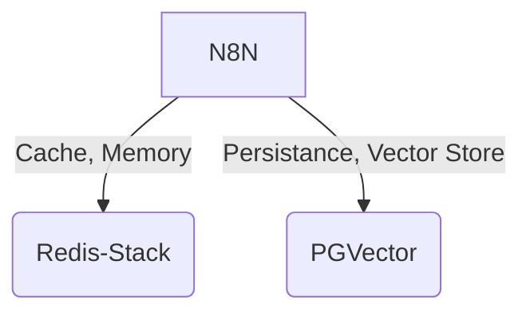

# N8N Docker Stack

I am sharing here a personal project to enable automation. 
I think this could be useful for those like me who want to simplify their daily routine by creating automatic flows 🚀 to offload low-value tasks! 
It works both at home 🏠 and at work 🏭 😉!


For questions, discord [@sibelius13](https://discordapp.com/users/sibelius13).


## Context

A basic docker stack to build a N8N Server Node to automate many task on your computer.



AT least compose a server with :
- a N8N service : basic community N8N app for flow automation
- a Redis Service  : for caching, building **AI Agent Memory** for example
- a  / PGVector service : for data persistance on building **AI Vector Stores**.


This project proposes a docker compose file, you can personnalize, to build your own local docker stack. 


## Preparation


### Volumes creation

You need 3 volumes to persist all services configuration and Data

``` shell
# For N8N
docker volume create n8n_data

# For REDIS
docker volume create redis_data

# For PGVECTOR
docker volume create pgvector_data
```


### Building an automation network

You can now create a network for all you automation services, so then can interact esalily.
Declaring an external network give you the ability for the futur, to connect other nodes to you N8N stack, depending of you needs. 


``` shell
docker network create --driver=bridge n8n_network
```


### Configure Environment

In order to build your stack, you can see tha compose use Env Vars. 
So define a `.env`file in your project and choose the service passwords you want to use. 

Here is the vars you need to review/complete : 

``` shell
# The top level domain to serve from
DOMAIN_NAME=localhost
PORT=5678

SHARED_FOLDER=<local path you want to expose to N8N>

# Redis PASSWORDS
REDIS_PASSWORD=<your pass>

# PGVector
PGVECTOR_DB=automation
PGVECTOR_USER=n8n
PGVECTOR_PASSWORD=<your pass>

# Optional timezone to set which gets used by Cron-Node by default
GENERIC_TIMEZONE=Europe/Paris
```


## Compose Review


``` YAML
name: "n8n-automation"

#------------------------------------------------------------------------------
#
# NETWORKS
#
# -----------------------------------------------------------------------------
networks:
  n8n_network:
    external: true

#------------------------------------------------------------------------------
#
# VOLUMES
#
# -----------------------------------------------------------------------------
volumes:
  n8n_data:
    external: true
  redis_data:
    external: true
  pgvector_data:
    external: true


#------------------------------------------------------------------------------
#
# SERVICES
#
# -----------------------------------------------------------------------------
services:
  n8n:
    image: n8nio/n8n:latest
    container_name: n8n-engine
    restart: unless-stopped
    ports:
      - "5678:5678"
    environment:
      - N8N_HOST=${DOMAIN_NAME}
      - N8N_PORT=${PORT}
      - N8N_PROTOCOL=http
      - NODE_ENV=production
      - WEBHOOK_URL=http://${DOMAIN_NAME}:${PORT}/
      - GENERIC_TIMEZONE=${GENERIC_TIMEZONE}
      # Logging
      - N8N_LOG_LEVEL=INFO
      - N8N_LOG_FILE_LOCATION=/files/logs/n8n.logs
      - N8N_LOG_OUTPUT=console,file
      - N8N_LOG_FILE_SIZE_MAX=20
      - N8N_LOG_FILE_COUNT_MAX=10
    depends_on:
      - redis
      - pgvector
    volumes:
      - n8n_data:/home/node/.n8n
      # Your can personnalize here local folder you need/want to share
      - ${SHARED_FOLDER}/Files:/files
      - ${SHARED_FOLDER}/Logs:/files/logs
      - ${SHARED_FOLDER}/Backups:/files/backups
    networks:
      - n8n_network
      
  redis:
    image: redis/redis-stack:latest
    container_name: redis-service
    restart: unless-stopped
    ports:
      - "6379:6379"
      - "8001:8001"
    environment:
      - REDIS_ARGS=--requirepass ${REDIS_PASSWORD} --appendonly yes --save 900 1 --save 300 10 --save 60 10000 --maxmemory 256mb --maxmemory-policy allkeys-lru
    volumes:
      - redis_data:/data
    networks:
      - n8n_network
    healthcheck:
      test: ["CMD", "redis-cli", "-a", "${REDIS_PASSWORD}", "ping"]
      interval: 30s
      timeout: 10s
      retries: 5
      start_period: 10s

  pgvector:
    image: pgvector/pgvector:pg17
    container_name: pgvector-service
    restart: unless-stopped
    environment:
      POSTGRES_DB: ${PGVECTOR_DB}
      POSTGRES_USER: ${PGVECTOR_USER}
      POSTGRES_PASSWORD: ${PGVECTOR_PASSWORD}
    volumes:
      - pgvector_data:/var/lib/postgresql/data
    ports:
      - "5432:5432"
    networks:
      - n8n_network
    
```

After adjusting your compose, you can start your stack 

``` shell
docker compose up -d
```

## Deployment with Podman on Fedora Workstation

This section outlines how to deploy the N8N stack using Podman on a Fedora Workstation environment. Podman provides a daemonless container engine compatible with Docker commands.

### Prerequisites

1.  **Install Podman:** Fedora Workstation usually comes with Podman pre-installed. If not, install it using:
    ```bash
    sudo dnf install podman
    ```
2.  **Install podman-compose:** This tool allows you to use `compose.yaml` files with Podman.
    ```bash
    sudo dnf install podman-compose
    ```
3.  **Firewall Configuration (if applicable):** Ensure that ports 80 (for HTTP) and 443 (for HTTPS) are open in your firewall (e.g., `firewalld`) to allow external access to Traefik:
    ```bash
    sudo firewall-cmd --add-service=http --permanent
    sudo firewall-cmd --add-service=https --permanent
    sudo firewall-cmd --reload
    ```

### Setup Steps

1.  **Clone the Repository:**
    ```bash
    # git clone <repository_url>
    # cd <repository_directory>
    ```

2.  **Create External Volumes:**
    Podman requires volumes to be created before they can be used as external volumes in `compose.yaml`.
    ```bash
    podman volume create n8n_data
    podman volume create redis_data
    podman volume create pgvector_data
    podman volume create traefik_data
    ```
    *Note: While `n8n_data` is no longer used for N8N's primary database (which is now PostgreSQL), it might still be referenced in `compose.yaml` for other potential uses like custom node installations or if a user decides to revert persistence. It's good practice to create all declared external volumes.*

3.  **Create External Network:**
    Similarly, create the external network:
    ```bash
    podman network create n8n_network
    ```

4.  **Configure Environment Variables (`.env` file):**
    Create a `.env` file in the root of the project directory. Copy the example variables from the "Configure Environment" section of this README and customize them.
    **Crucially, ensure you set the `DOMAIN_NAME` variable to your publicly accessible domain or a domain that resolves to your Fedora machine's IP address for Traefik and Let's Encrypt to work correctly.**
    You also need to add the `ACME_EMAIL` variable for Traefik's SSL certificate generation:
    ```dotenv
    # ... other variables from the README ...

    # Traefik - Let's Encrypt Email
    # IMPORTANT: Replace with your actual email address for SSL certificate generation
    ACME_EMAIL=your-email@example.com
    ```

5.  **SELinux Considerations (Important for Volume Mounts):**
    When using Podman on systems with SELinux enabled (like Fedora), you might need to append `:Z` or `:z` to your volume mounts in `compose.yaml` if you encounter permission issues. For example, the `SHARED_FOLDER` mount for the `n8n` service might need to be:
    `- ${SHARED_FOLDER}/Files:/files:Z`
    The `:Z` flag tells Podman to relabel the host directory to be shared among multiple containers, while `:z` relabels it for use only by that specific container. Review your `compose.yaml` and adjust local volume mounts if necessary. This typically applies to bind mounts from your host system, not named volumes managed by Podman.

6.  **Run the Stack:**
    Use `podman-compose` to bring up the services:
    ```bash
    podman-compose up -d
    ```

### Accessing N8N

Once the stack is running, Traefik will automatically obtain an SSL certificate for your specified `DOMAIN_NAME`. You should be able to access N8N securely at:
`https://<your_domain_name>`

The Traefik dashboard (if enabled and configured for external access in your `compose.yaml`) can be accessed as per its configuration (e.g., `http://<your_domain_name>:8080` if routed, or via its exposed port if directly mapped and firewall allows). The current setup uses `--api.insecure=true` which exposes it on port `8080` of the Traefik container.

### Stopping the Stack
```bash
podman-compose down
```


## Scripts : backuping, updating

Before using all shell scripts described here, you have to update the following `n8n-env.sh` script :

``` shell
#!/usr/bin/zsh

# Dossier choisi pour déposer les backups (local machine)
BACKUP_DIR=~/Docker/Backups

# Endpoint de HealtCheck
# Adaptez ici l'URL en fonction de vitre WebHook local @see [Notif_Backup](./DOCKER___Stack_Health_Check.json)
# IIL faut pointer sur le webhook de votre flow (Activé -> URL de Production)
N8N_HEALTHCHECK_URL=http://localhost:5678/webhook/ff4fa298-3c06-4540-b426-9bedac2426ca


# Timestamp d'execution
TIMESTAMP=$(date +%Y%m%d_%H%M%S)
CALLPARAM=$(date --iso-8601=seconds)
```

So adapt the **BACKUP_DIR** for your computer and change the **HEALTHCHECK_URL**. This is a _tutorial-level_ n8n flow to check that all N8N dependencies are functioning well.


### Backuping

I wrote a simple shell script to back up the volumes of different services. 
This helps prevent data loss from accidental mishandling.

For this backup, I mount the volumes in an ephemeral container for the duration of archiving its contents. 
This requires stopping the stack to ensure data consistency.

See [backup.sh](./backup.sh)


### Updating

N8N frequently releases fixes and updates. 
So, I wrote a shell script to update it easily. 
The first step in this update is to perform a preliminary backup.


See [update-n8n.sh](./update-n8n.sh)


### Restoring

I Wrote a script for restoring, but it need more work to be easy to use.
> Additional work to be done! 😉

See [restore.sh](./restore.sh)
