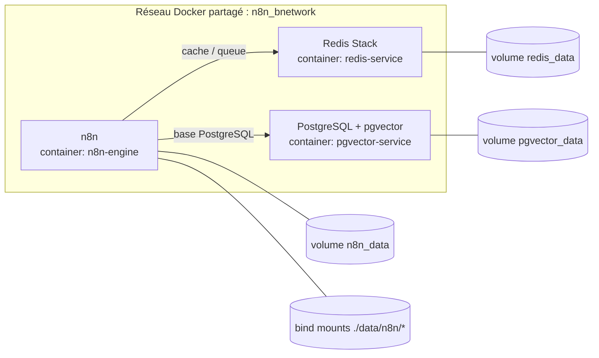

# N8N Docker Stack


```mermaid
flowchart LR
  subgraph NET["Réseau Docker partagé : n8n_bnetwork"]
    N8N["n8n\ncontainer: n8n-engine"]
    REDIS["Redis Stack\ncontainer: redis-service"]
    PG["PostgreSQL + pgvector\ncontainer: pgvector-service"]
  end

  N8N -->|cache / queue| REDIS
  N8N -->|base PostgreSQL| PG

  VN8N[("volume n8n_data")]
  VREDIS[("volume redis_data")]
  VPG[("volume pgvector_data")]
  BIND[("bind mounts ./data/n8n/*")]

  N8N --- VN8N
  N8N --- BIND
  REDIS --- VREDIS
  PG --- VPG
```

Stack Docker locale pour exécuter n8n Community avec Redis Stack et PostgreSQL + pgvector sur le même réseau Docker.

## Vue d'ensemble

La stack crée et exploite les éléments suivants :

- service `n8n` exposé sur `http://localhost:5678`
- service `redis/redis-stack:latest` protégé par mot de passe
- service `pgvector/pgvector:pg18-trixie` avec rôles, bases et schémas dédiés
- réseau Docker `n8n_bnetwork`
- volumes nommés `n8n_data`, `redis_data`, `pgvector_data`
- bind mounts sous `./data/n8n/` pour les fichiers, logs et sauvegardes

## Skills locales

Le dépôt embarque des skills Codex dans `.codex/skills/` pour automatiser les opérations courantes sur la stack :

- `n8n-stack-create` : crée ou recrée la stack, valide `compose.yaml`, récupère les images et vérifie que les services sont démarrés.
- `n8n-stack-destroy` : supprime complètement la stack locale, y compris les conteneurs, volumes nommés et le réseau Docker.
- `n8n-stack-backup` : arrête temporairement les services, archive les volumes `n8n_data`, `redis_data` et `pgvector_data`, puis redémarre la stack.
- `n8n-stack-restore` : restaure un jeu de sauvegarde existant dans les volumes Docker puis relance la stack.
- `n8n-runtime-control` : arrête ou redémarre le service `n8n`, puis lit les logs récents pour confirmer que le container est sain.
- `n8n-ui-healthcheck` : lance un contrôle de santé bout en bout dans l'interface n8n avec Playwright, login inclus.

Ces skills sont conçues pour être invoquées depuis Codex sur ce dépôt afin d'éviter de répéter les mêmes procédures manuelles.

## Configuration n8n

Le service `n8n` est configuré pour :

- utiliser l'image `docker.n8n.io/n8nio/n8n:latest`
- supprimer les exécutions au-delà de 72 heures
- écrire les logs dans `./data/n8n/logs/n8n.log`
- autoriser les Community Nodes
- activer l'API publique n8n
- activer l'interface Swagger
- stocker ses données applicatives dans PostgreSQL via `pgvector`

## Variables d'environnement

Copier `.env.example` vers `.env`, puis remplacer les secrets par vos valeurs avant le premier démarrage.

```dotenv
# n8n runtime
TZ=Europe/Paris
GENERIC_TIMEZONE=Europe/Paris
N8N_BIND_IP=127.0.0.1
N8N_HOST_PORT=5678
N8N_HOST=localhost
N8N_PROTOCOL=http
N8N_EDITOR_BASE_URL=http://localhost:5678
N8N_WEBHOOK_URL=http://localhost:5678/

# Host mounts used by n8n
N8N_FILES_DIR=./data/n8n/files
N8N_LOGS_DIR=./data/n8n/logs
N8N_BACKUPS_DIR=./data/n8n/backups

# Redis
REDIS_PASSWORD=change-me-redis

# PostgreSQL / pgvector
PGVECTOR_ADMIN_USER=postgres
PGVECTOR_ADMIN_PASSWORD=change-me-postgres-admin
PGVECTOR_N8N_DB=n8n
PGVECTOR_N8N_USER=n8n
PGVECTOR_N8N_PASSWORD=change-me-n8n-db
PGVECTOR_N8N_SCHEMA=n8n
PGVECTOR_CLIENT_DB=n8n_client
PGVECTOR_CLIENT_USER=n8n_client
PGVECTOR_CLIENT_PASSWORD=change-me-n8n-client-db
PGVECTOR_CLIENT_SCHEMA=n8n_client

# UI user for browser-based healthchecks
UI_USER_EMAIL=owner@example.com
UI_USER_PASSWORD=change-me-ui-password
```

Si un mot de passe contient `$`, l'écrire comme `$$` dans `.env` pour que Docker Compose l'interprète correctement.

## Initialisation PostgreSQL

Le fichier `postgres/initdb/01-init-n8n.sh` s'exécute au premier démarrage d'un volume PostgreSQL vide pour :

- créer le rôle et la base dédiés à n8n
- créer un second rôle et une seconde base client
- activer l'extension `vector` dans les deux bases
- créer les schémas dédiés
- définir le `search_path` de chaque rôle sur son schéma et `public`

## Démarrage de la stack

```bash
mkdir -p data/n8n/files data/n8n/logs data/n8n/backups
docker compose config
docker compose pull
docker compose up -d
docker compose ps
```

Accéder ensuite à n8n via `http://localhost:5678`.

## Arrêt et suppression

Pour arrêter les conteneurs sans supprimer les données :

```bash
docker compose stop
```

Pour supprimer la stack complète :

```bash
docker compose down --remove-orphans
docker volume rm n8n_data redis_data pgvector_data
docker network rm n8n_bnetwork
```

## Sauvegarde et restauration

Les scripts projet disponibles sont :

- `./backup.sh` : arrête la stack, archive les volumes, redémarre les services puis déclenche le healthcheck webhook.
- `./restore.sh [timestamp|latest]` : restaure la dernière sauvegarde ou un lot horodaté précis, puis redémarre la stack.
- `./check-stack.sh` : envoie une requête POST vers le webhook déclaré dans `n8n-env.sh`.

Ajuster `BACKUP_DIR` et `N8N_HEALTHCHECK_URL` dans `n8n-env.sh` selon l'environnement local.

## Healthchecks

- Redis : `redis-cli --pass "$REDIS_PASSWORD" ping`
- PostgreSQL : `pg_isready -U "$POSTGRES_USER" -d postgres`
- UI n8n : utilisation de `UI_USER_EMAIL` et `UI_USER_PASSWORD` pour les tests Playwright

## Notes dépôt

- les données runtime sous `data/` sont ignorées par Git
- les artefacts Playwright sous `.playwright-mcp/` sont ignorés par Git
